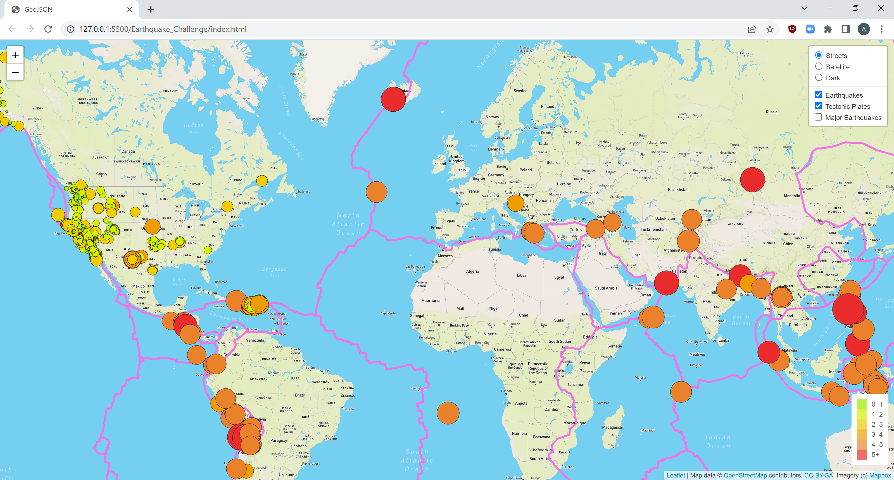
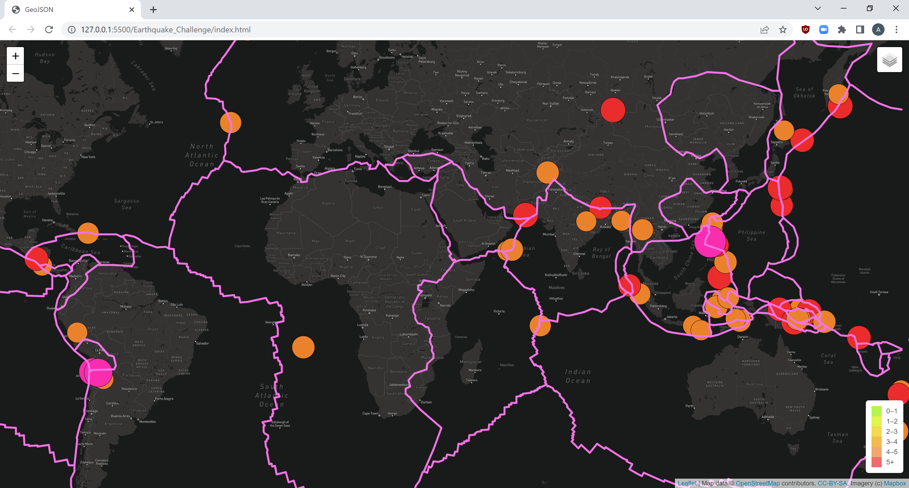

# Mapping_Earthquakes

## Overview

In this module, we used Javascript, HTML, Leaflet, and the MapBox API to plot earthquake data from the past seven days

## Process

Our goal was to plot earthquake data from the past week and to provide the magnitude and location details for each one.  To do this, we started by using a small CSS file to direct the on-screen dimensions of the map and legend.  Then, in our challenge_logic.js file, we called the MapBox API to build different base map layers, making sure to keep our API key in an untracked config.js file.  We then defined three layer groups for all the earthquakes, the major earthquakes, and Earth's tectonic plates.  Leaflet allowed us to provide each layer and group as a selectable option on our map.  We used the d3 library to read in data for each group.  Within the allEarthquakes and majorEarthquakes layer groups, we wrote functions to show each earthquake as a circleMarker with varying color and radius depending on magnitude.  We then used onEachFeature and bindPopup() to attach informative markers to each circle on the map.  A legend was built using another layer that defined corresponding arrays of magnitudes and colors and used a for loop with innerHTML to iterate through the arrays and display the desired magnitude colors as a reference point for viewers.

To display the map successfully, our index.html file reads Leaflet's documentation in with our CSS, and then we apply our Javascript.

## Images

### All Earthquakes and Tectonic Plates

### Major Earthquakes and Tectonic Plates, Dark Map

